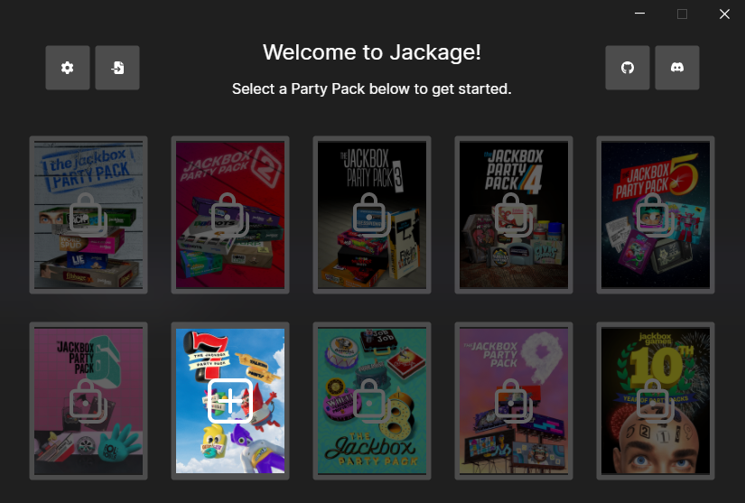

  

# Jackage
A desktop app for creating, maintaining, and sharing custom Jackbox entries for games that allow it.

## Editor Coverage
I don't own Jackbox 8, 9, and 10 so I can't do any testing on whether these are viable for the editor. Crossed out games are never going to be implemented. Some games aren't crossed out only because I've personally never played them and have no idea if they would work.

#### [Jackbox 7](https://www.jackboxgames.com/party-pack-seven/)
- [ ] ***[Planned]*** Quiplash 3 
- [ ] The Devil's In The Details
- [ ] Champ'd Up
- [ ] Talking Points
- [ ] ***[Working On]*** Blather Round

#### [Jackbox 6](https://www.jackboxgames.com/party-pack-six/)
- [ ] ***[Planned]*** Trivia Murder Party 2 
- [ ] Role Models
- [ ] Joke Boat
- [ ] Dictionarium
- [ ] Push The Button

#### [Jackbox 5](https://www.jackboxgames.com/party-pack-five/)
- [ ] You Don't Know Jack: Full Stream
- [ ] Split The Room
- [ ] Mad Verse City
- [ ] Patently Stupid
- [ ] Zeeple Dome

#### [Jackbox 4](https://www.jackboxgames.com/party-pack-four/)
- [ ] ~~Fibbage 3~~ (newer version available)
- [ ] Survive The Internet
- [ ] Monster Seeking Monster
- [ ] Bracketeering
- [ ] Civic Doodle

#### [Jackbox 3](https://www.jackboxgames.com/party-pack-three/)
- [ ] ~~Quiplash 2~~ (newer version available)
- [ ] ~~Trivia Murder Party~~ (newer version available)
- [ ] Guesspionage
- [ ] ~~Tee KO~~ (not a text based game)
- [ ] Fakin' It

#### [Jackbox 2](https://www.jackboxgames.com/party-pack-two/)
- [ ] ~~Fibbage 2~~ (newer version available)
- [ ] Earwax
- [ ] Bidiots
- [ ] ~~Quiplash XL~~ (newer version available)
- [ ] Bomb Corp

#### [Jackbox 1](https://www.jackboxgames.com/party-pack/)
- [ ] ~~You Don't Know Jack: 2015~~ (newer version available)
- [ ] ~~Fibbage XL~~ (newer version available)
- [ ] ~~Drawful~~ (not a text based game)
- [ ] Word Spud
- [ ] Lie Swatter

## Attributing
Logo is the [package emoji](https://openmoji.org/library/emoji-1F4E6/) designed by [OpenMoji](https://openmoji.org/) – the open-source emoji and icon project. License: [CC BY-SA 4.0](https://creativecommons.org/licenses/by-sa/4.0/#)